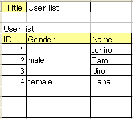

XLSBeans [](https://travis-ci.org/takezoe/xlsbeans) [](https://maven-badges.herokuapp.com/maven-central/com.github.takezoe/xlsbeans)
========

XLSBeans is a Java library for mapping Excel sheets to POJO.


## Setup

To use XLSBeans, add the following dependency to your pom.xml:

```xml
<dependencies>
  <dependency>
    <groupId>com.github.takezoe</groupId>
    <artifactId>xlsbeans</artifactId>
    <version>1.2.7</version>
  </dependency>
</dependencies>
```

## Getting Started

For example, here is one Excel sheet.



Map this Excel sheet to POJO using ```@HorizontalRecords``` and ```@LabelledCell```.

```java
@Sheet(name="Users")
public class UserList {

  @LabelledCell(label="Title", type=LabelledCellType.Right)
  public String title;

  @HorizontalRecords(tableLabel="User list", recordClass=User.class)
  public List<User> users;

}
```

And the following is the record class. Properties of the record class is mapped to columns by ```@Column```.

```java
public class User {

  @Column(columnName="ID")
  public int id;

  @Column(columnName="Name")
  public String name;

  @Column(columnName="Gender", merged=true)
  public String gender;

}
```

You can get the mapped POJO using ```XLSBeans#load()``` like following:

```java
UserList userList = (UserList)new XLSBeans().load(
  new FileInputStream("example.xls"), UserList.class);
```

## Documentation

See more details in http://amateras.sourceforge.jp/site/xlsbeans/howtouse.html (in Japanese)
